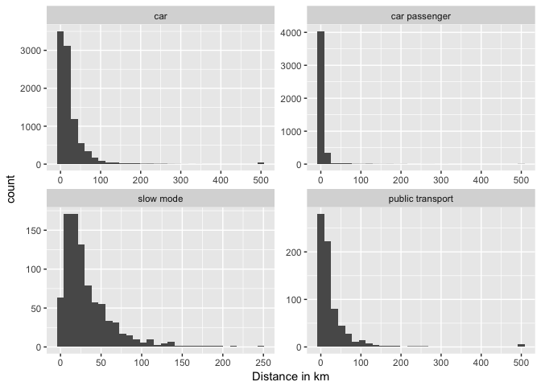
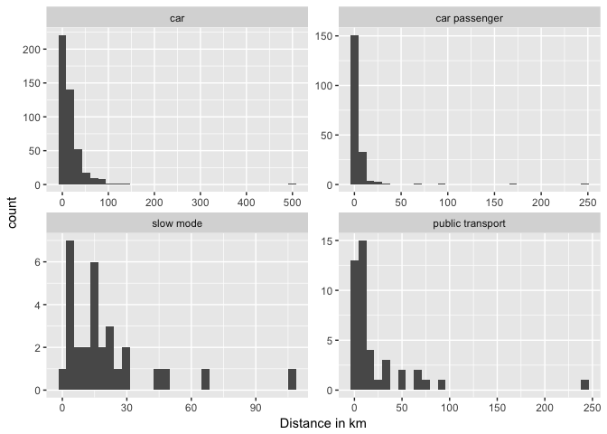
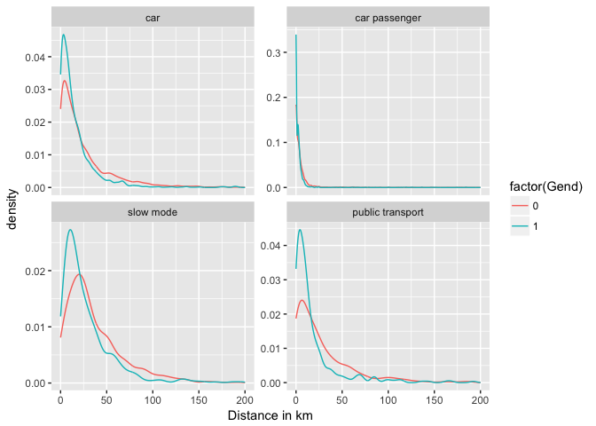
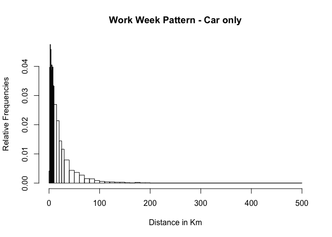
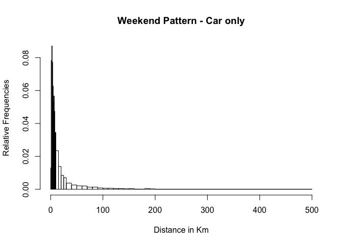
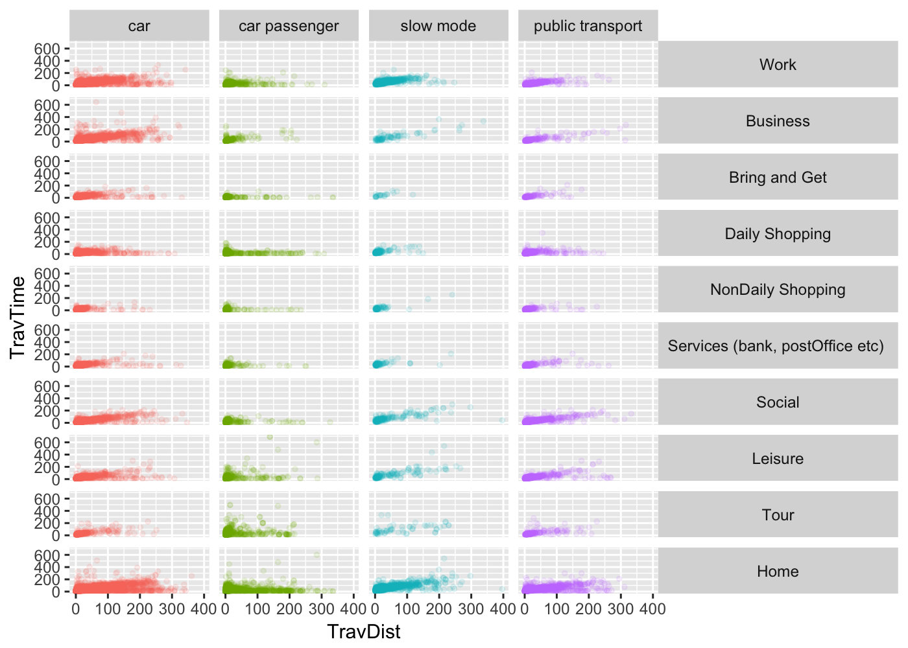
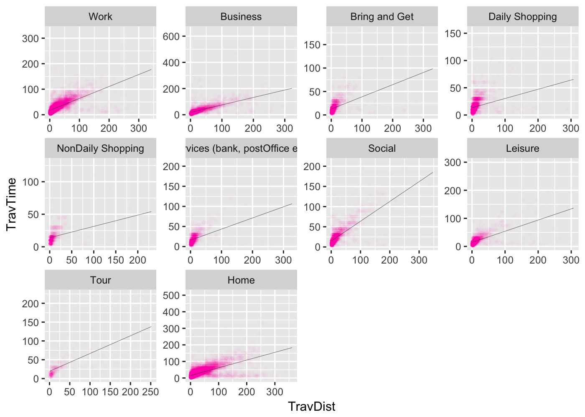
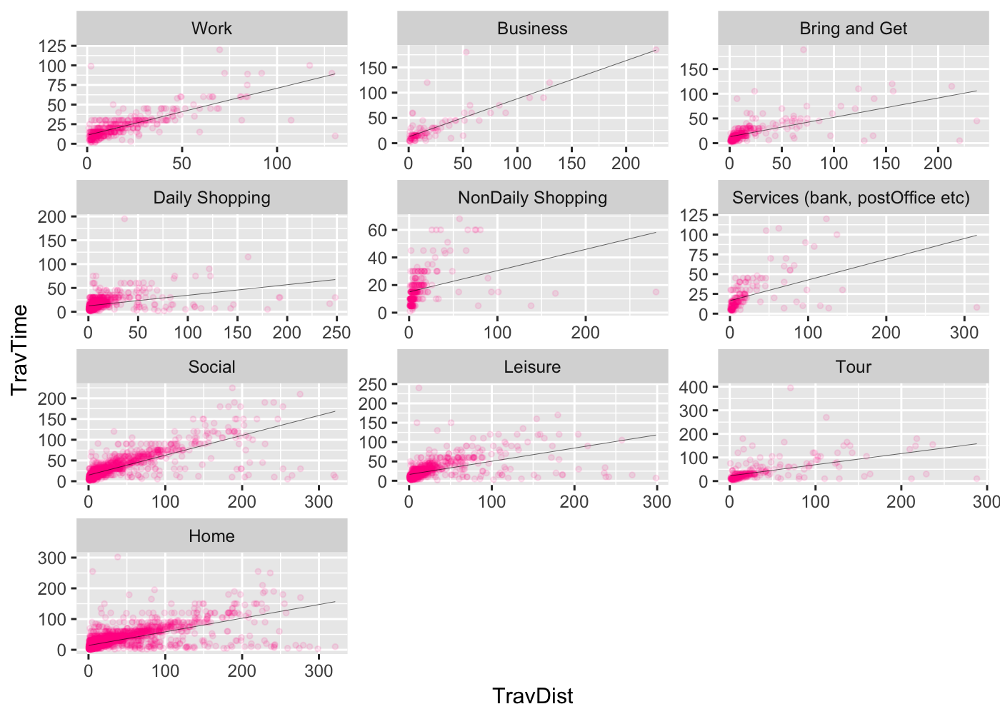
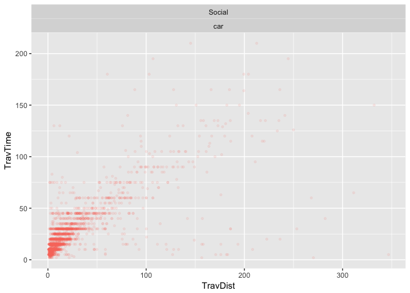

Albatross Travel Patterns
================
Srirama Bhamidipati
20 July 2017

Summary
-------

#### Questions

1.  How many modes of travel are reported in Albatross?
2.  How many activities are registered in Albatross?
3.  Which modes are used for travel to work?
4.  How far do people travel to work?
5.  How does travel pattern look on weekends?
6.  How does the (work) travel pattern look on weekdays?
7.  Extracting work pattern on weekdays.
8.  Extracting (car) work pattern on weekdays.
9.  Extracting travel pattern on weekends.
10. Extracting (car) travel pattern on weekends.

#### 1. How many and which modes?

    ## [1] "car"              "car passenger"    "slow mode"       
    ## [4] "public transport"

#### 2. How many and which activities?

    ##  [1] "Work"                             "Business"                        
    ##  [3] "Bring and Get"                    "Daily Shopping"                  
    ##  [5] "NonDaily Shopping"                "Services (bank, postOffice etc) "
    ##  [7] "Social"                           "Leisure"                         
    ##  [9] "Tour"                             "Home"

#### 3. Which modes are used for travel to work?


#### 4. How far do people travel to work?



#### 5. How does the travel pattern look on weekends?



#### 6. How does the ((work)) travel pattern look on weekdays ?


<!-- #### 6. How does travel pattern differ by gender? -->
<!-- ```{r} -->
<!-- ggplot(data=monCleaned_Distance[monCleaned_Distance$Atype=="Work" & monCleaned_Distance$Day <=5,], aes(x=TravDist, fill=factor(Gend), colour=factor(Gend))) +  -->
<!--   geom_line(stat = "density")+ -->
<!--   #geom_histogram()+ -->
<!--  # geom_freqpoly(data=monCleaned_Distance[monCleaned_Distance$Atype=="Work" & monCleaned_Distance$Day <=5 & monCleaned_Distance$Gend==0,], binwidth = 5) + -->
<!--   #geom_line(data=monCleaned_Distance[monCleaned_Distance$Atype=="Work" & monCleaned_Distance$Day <=5 & monCleaned_Distance$Gend==0,],stat = "density", colour="blue", alpha=0.2) + -->
<!--  # geom_line(data=monCleaned_Distance[monCleaned_Distance$Atype=="Work" & monCleaned_Distance$Day <=5 & monCleaned_Distance$Gend==1,],stat = "density", colour="red", alpha=0.2) + -->
<!--   #geom_density(colour=NA, fill="blue", alpha=0.2)+  -->
<!--   facet_wrap(~Mode, ncol = 2, scales = "free_y") +  -->
<!--   xlab("Distance in km") +  xlim(0,200)  -->
<!-- ``` -->
#### 7. Extracting work pattern on weekdays

For control over what distance ranges are extracted from the MON data, we define our own distance bins.



#### 8. Extracting (car) work pattern on weekdays

For control over what distance ranges are extracted from the MON data, we define our own distance bins.



|  bin\_low|  bin\_high|   carsOnly|   allModes|
|---------:|----------:|----------:|----------:|
|         0|          1|  0.0041578|  0.0082645|
|         1|          2|  0.0396769|  0.0691854|
|         2|          3|  0.0475172|  0.0792601|
|         3|          4|  0.0458541|  0.0664305|
|         4|          5|  0.0387265|  0.0506100|
|         5|          6|  0.0405084|  0.0462810|
|         6|          7|  0.0396769|  0.0408501|
|         7|          8|  0.0397957|  0.0404565|
|         8|          9|  0.0333809|  0.0319559|
|         9|         10|  0.0332621|  0.0293585|
|        10|         15|  0.1348301|  0.1145218|
|        15|         20|  0.1069138|  0.0882330|
|        20|         25|  0.0723450|  0.0606061|
|        25|         30|  0.0580898|  0.0484061|
|        30|         40|  0.0793538|  0.0646202|
|        40|         50|  0.0437158|  0.0369146|
|        50|         60|  0.0365883|  0.0322708|
|        60|         70|  0.0273224|  0.0235340|
|        70|         80|  0.0153243|  0.0134593|
|        80|         90|  0.0147303|  0.0120425|
|        90|        100|  0.0087907|  0.0075561|
|       100|        110|  0.0058209|  0.0054309|
|       110|        120|  0.0042766|  0.0043290|
|       120|        130|  0.0039202|  0.0036206|
|       130|        140|  0.0030886|  0.0028335|
|       140|        150|  0.0030886|  0.0026761|
|       150|        160|  0.0015443|  0.0013381|
|       160|        170|  0.0009503|  0.0011019|
|       170|        180|  0.0024947|  0.0019677|
|       180|        190|  0.0011879|  0.0011806|
|       190|        200|  0.0011879|  0.0010232|
|       200|        500|  0.0118793|  0.0096812|

#### 9. Extracting travel pattern on weekends

For control over what distance ranges are extracted from the MON data, we define our own distance bins.


#### 10. Extracting (car) travel pattern on weekends

For control over what distance ranges are extracted from the MON data, we define our own distance bins.



|  bin\_low|  bin\_high|   carsOnly|   allModes|
|---------:|----------:|----------:|----------:|
|         0|          1|  0.0129443|  0.0225864|
|         1|          2|  0.0782141|  0.1224732|
|         2|          3|  0.0870996|  0.1074875|
|         3|          4|  0.0772269|  0.0794566|
|         4|          5|  0.0627468|  0.0635006|
|         5|          6|  0.0529838|  0.0513719|
|         6|          7|  0.0567135|  0.0470056|
|         7|          8|  0.0473892|  0.0391893|
|         8|          9|  0.0346643|  0.0308339|
|         9|         10|  0.0344449|  0.0290550|
|        10|         15|  0.1173760|  0.1032828|
|        15|         20|  0.0692190|  0.0539054|
|        20|         25|  0.0425625|  0.0384346|
|        25|         30|  0.0353225|  0.0295402|
|        30|         40|  0.0372971|  0.0330440|
|        40|         50|  0.0262176|  0.0239879|
|        50|         60|  0.0210619|  0.0190286|
|        60|         70|  0.0200746|  0.0176271|
|        70|         80|  0.0127249|  0.0136920|
|        80|         90|  0.0133831|  0.0114819|
|        90|        100|  0.0084467|  0.0090022|
|       100|        110|  0.0063624|  0.0070077|
|       110|        120|  0.0062527|  0.0070616|
|       120|        130|  0.0049364|  0.0043663|
|       130|        140|  0.0048267|  0.0051749|
|       140|        150|  0.0030715|  0.0026953|
|       150|        160|  0.0036200|  0.0038273|
|       160|        170|  0.0014261|  0.0025336|
|       170|        180|  0.0012067|  0.0012937|
|       180|        190|  0.0037297|  0.0032343|
|       190|        200|  0.0025230|  0.0021023|
|       200|        500|  0.0139315|  0.0147162|

Cleaning Data
-------------

It was found that the data has some problems interms of Travel Distance not matching with Travel Time. For example, some people could reach 500km in 5 minutes. This does not make sense. After careful deliberation, it was decided to discard all households where the Travel Distance atrribute is 500.

#### Cleaned : Travel Distance vs Travel Time - All modes - All purposes - Weekdays



#### Cleaned : Travel Distance vs Travel Time - car - All purposes



#### Cleaned : Travel Distance vs Travel Time - car - work



#### Cleaned : Travel Distance vs Travel Time - car - work


