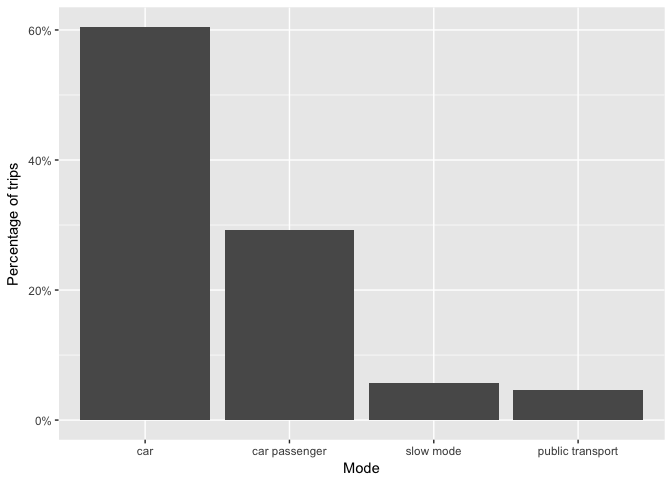

Albatross Travel Patterns
================
Srirama Bhamidipati
22 July 2017

Summary
-------

#### Questions

1.  How many modes of travel are reported in Albatross?
2.  How many activities are registered in Albatross?
3.  Which modes are used for travel to work?

#### 1. How many and which modes?

    ## [1] "car"              "car passenger"    "slow mode"       
    ## [4] "public transport"

#### 2. How many and which activities?

    ##  [1] "Work"                             "Business"                        
    ##  [3] "Bring and Get"                    "Daily Shopping"                  
    ##  [5] "NonDaily Shopping"                "Services (bank, postOffice etc) "
    ##  [7] "Social"                           "Leisure"                         
    ##  [9] "Tour"                             "Home"

#### 3. Which modes are used for travel to work?

