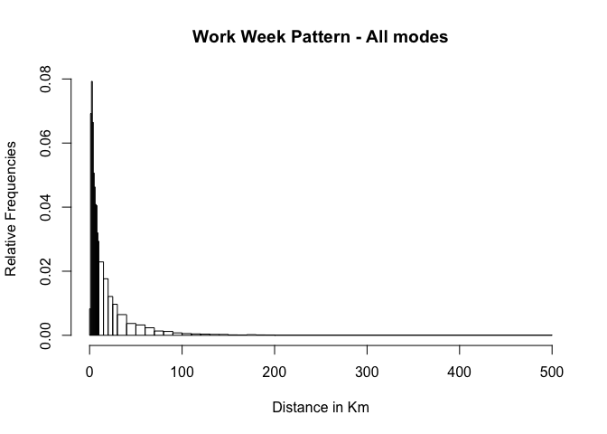

Albatross Travel Patterns
================
Srirama Bhamidipati
20 July 2017

Summary
-------

#### Questions

1.  How many modes of travel are reported in Albatross?
2.  How many activities are registered in Albatross?
3.  Which modes are used for travel to work?

#### 1. How many and which modes?

    ## [1] "car"              "car passenger"    "slow mode"       
    ## [4] "public transport"

#### 2. How many and which activities?

    ##  [1] "Work"                             "Business"                        
    ##  [3] "Bring and Get"                    "Daily Shopping"                  
    ##  [5] "NonDaily Shopping"                "Services (bank, postOffice etc) "
    ##  [7] "Social"                           "Leisure"                         
    ##  [9] "Tour"                             "Home"

#### 3. Which modes are used for travel to work?

#### 3. How far do people travel to work?

#### 4. How does the travel pattern look on weekends?

#### 5. How does the ((work)) travel pattern look on weekdays ?

#### 6. How does travel pattern differ by gender?

#### 7. Extracting work pattern on weekdays

For control over what distance ranges are extracted from the MON data, we define our own distance bins.

|  bin\_low|  bin\_high|  proportion|
|---------:|----------:|-----------:|
|         0|          1|   0.0082645|
|         1|          2|   0.0691854|
|         2|          3|   0.0792601|
|         3|          4|   0.0664305|
|         4|          5|   0.0506100|
|         5|          6|   0.0462810|
|         6|          7|   0.0408501|
|         7|          8|   0.0404565|
|         8|          9|   0.0319559|
|         9|         10|   0.0293585|
|        10|         15|   0.1145218|
|        15|         20|   0.0882330|
|        20|         25|   0.0606061|
|        25|         30|   0.0484061|
|        30|         40|   0.0646202|
|        40|         50|   0.0369146|
|        50|         60|   0.0322708|
|        60|         70|   0.0235340|
|        70|         80|   0.0134593|
|        80|         90|   0.0120425|
|        90|        100|   0.0075561|
|       100|        110|   0.0054309|
|       110|        120|   0.0043290|
|       120|        130|   0.0036206|
|       130|        140|   0.0028335|
|       140|        150|   0.0026761|
|       150|        160|   0.0013381|
|       160|        170|   0.0011019|
|       170|        180|   0.0019677|
|       180|        190|   0.0011806|
|       190|        200|   0.0010232|
|       200|        500|   0.0096812|

#### 7. Extracting (car) work pattern on weekdays

For control over what distance ranges are extracted from the MON data, we define our own distance bins.

|  bin\_low|  bin\_high|  proportion|
|---------:|----------:|-----------:|
|         0|          1|   0.0082645|
|         1|          2|   0.0691854|
|         2|          3|   0.0792601|
|         3|          4|   0.0664305|
|         4|          5|   0.0506100|
|         5|          6|   0.0462810|
|         6|          7|   0.0408501|
|         7|          8|   0.0404565|
|         8|          9|   0.0319559|
|         9|         10|   0.0293585|
|        10|         15|   0.1145218|
|        15|         20|   0.0882330|
|        20|         25|   0.0606061|
|        25|         30|   0.0484061|
|        30|         40|   0.0646202|
|        40|         50|   0.0369146|
|        50|         60|   0.0322708|
|        60|         70|   0.0235340|
|        70|         80|   0.0134593|
|        80|         90|   0.0120425|
|        90|        100|   0.0075561|
|       100|        110|   0.0054309|
|       110|        120|   0.0043290|
|       120|        130|   0.0036206|
|       130|        140|   0.0028335|
|       140|        150|   0.0026761|
|       150|        160|   0.0013381|
|       160|        170|   0.0011019|
|       170|        180|   0.0019677|
|       180|        190|   0.0011806|
|       190|        200|   0.0010232|
|       200|        500|   0.0096812|
